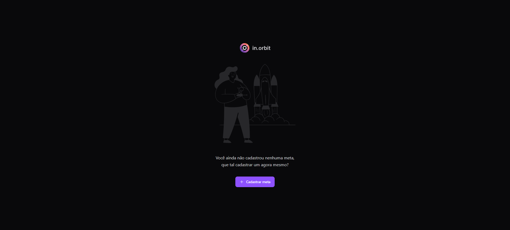
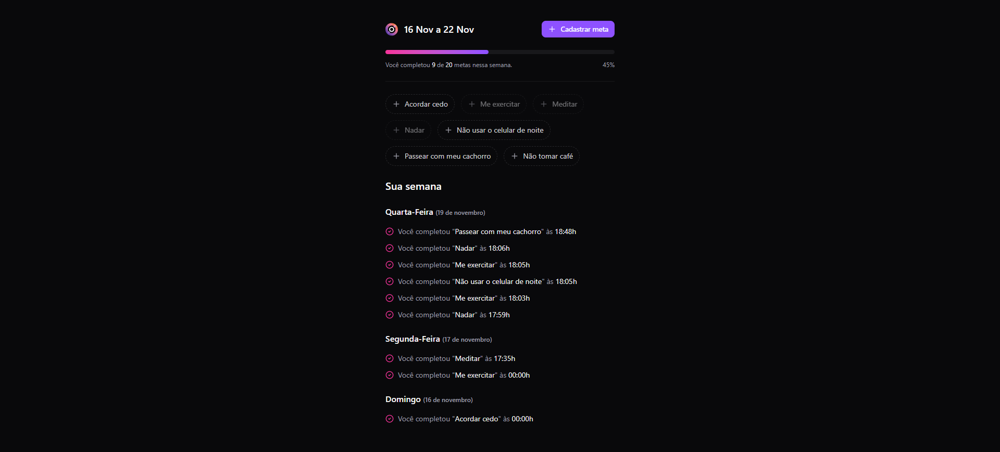
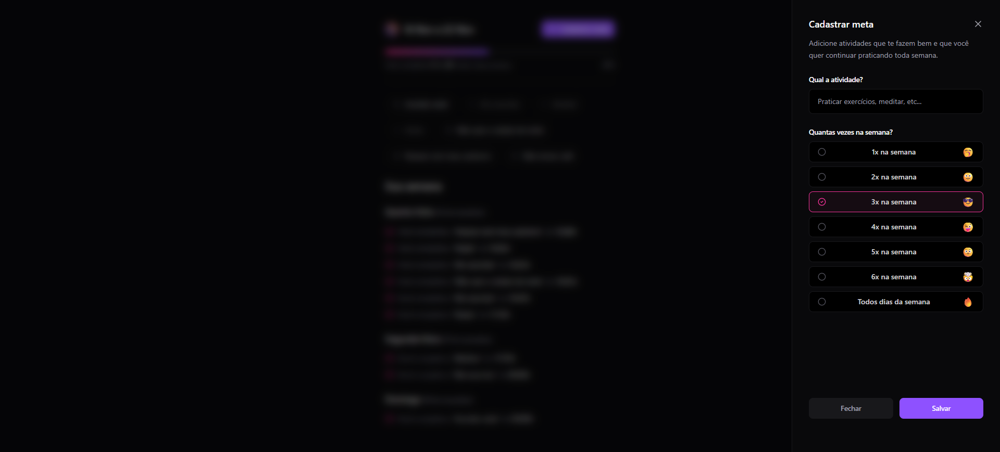

# 🚀 NLW Pocket in.orbit

  <a href="#server">API Server</a> 
  &#xa0; | &#xa0; 
  <a href="#web">Web</a>

🔗 **[Acesse o Deploy Online aqui](https://cidvieira.github.io/nlw-pocket-in.orbit/)**
 

## 💡 Sobre o Projeto

O **NLW Pocket in.orbit** é uma plataforma Fullstack robusta e moderna, desenvolvida para ser um gerenciador pessoal de **metas e hábitos**. A aplicação permite que os usuários criem, registrem e acompanhem suas metas semanais em tempo real, fornecendo uma visão clara do seu progresso e consistência.

Este projeto foi estruturado em duas partes distintas o **Frontend (Web)** e o **Backend (API Server)**, garantindo separação de responsabilidades, escalabilidade e manutenibilidade.

## ✨ Funcionalidades Principais

* **Criação e Gestão de Metas:** Cadastro de novas metas com definição de recorrência semanal.
* **Acompanhamento em Tempo Real:** Visualização do progresso das metas para cada dia da semana.
* **Registro de Conclusão:** Marcação intuitiva de metas completas ou pendentes em dias específicos.
* **Sumário Semanal:** Visão consolidada do desempenho semanal do usuário.
* **Interface Responsiva:** Experiência de usuário fluida e acessível em diferentes dispositivos.

## 🎨 Visualização

<table>
  <tr>
    <td align="center"><strong>Tela Inicial - Cadastrar Metas</strong></td>
    <td align="center"><strong>Registro e Visualização de Metas</strong></td>
    <td align="center"><strong>Formulário de Cadastro de Metas</strong></td>
  </tr>
  <tr>
    <td></td>
    <td></td>
    <td></td>
  </tr>
</table>

## 🧱 Arquitetura e Stack Tecnológica Fullstack

Este projeto combina o que há de mais moderno em desenvolvimento web para garantir performance, tipagem rigorosa e uma experiência de desenvolvimento (DX) de alto nível.

### 🌐 Frontend (Web)

Desenvolvido para ser uma Single Page Application (SPA), focada em performance e reutilização de código.

| Tecnologia | Finalidade | Destaques de Arquitetura |
| :--- | :--- | :--- |
| **React, TypeScript** | Interface de Usuário e Tipagem | Component-based Architecture |
| **TanStack Query (React Query)** | Gerenciamento de Estado Servidor | Gerencia cache, requisições e mutações com eficiência. |
| **TailwindCSS, Radix UI** | Estilização e Acessibilidade | Design system coeso, componentes acessíveis (CVA Pattern). |
| **Vite, Biome** | Build Tool e Padronização | Build rápido e formatação/linting de código rigorosa. |

### ⚙️ Backend (API Server)

Uma API RESTful de alta performance, projetada para ser o centro de dados e lógica de negócios.

| Tecnologia | Finalidade | Destaques de Arquitetura |
| :--- | :--- | :--- |
| **Node.js com TypeScript** | Servidor e Lógica de Negócios | Execução nativa de TS (`--experimental-strip-types`). |
| **Fastify** | Framework Web | Servidor robusto e eficiente, focado em alta velocidade. |
| **Drizzle ORM, PostgreSQL** | Banco de Dados e ORM | Operações de banco tipadas e seguras, com alta performance. |
| **Zod, Fastify Zod Provider** | Validação de Schema | Validação rigorosa de inputs e outputs (type-safe endpoints). |
| **Docker** | Containerização | Ambiente de desenvolvimento consistente para o banco de dados. |

## 🛠️ Como Executar o Projeto

Para colocar o projeto em funcionamento, você precisará executar o servidor e a interface web.

### 1. Requisitos

* Node.js (versão 18+)
* Docker e Docker Compose
* npm ou yarn

### 
2. Configuração do Backend (Server)

1.  Clone o repositório 🔗 [**server**](https://github.com/cidvieira/nlw-pocket-in.orbit/tree/main/server)
2.  Inicie o banco de dados com Docker: `docker-compose up -d`
3.  Instale dependências: `npm install`
4.  Execute as migrações do banco: `npx drizzle-kit migrate`
5.  Inicie o servidor: `npm run dev`
    *(A API estará rodando em `http://localhost:3333`)*

### 
3. Configuração do Frontend (Web)

1.  Clone o repositório 🔗 [**web**](https://github.com/cidvieira/nlw-pocket-in.orbit/tree/main/web)
2.  Instale dependências: `npm install`
3.  Inicie a aplicação: `npm run dev`
    *(O frontend estará acessível em `http://localhost:5173`)*

---